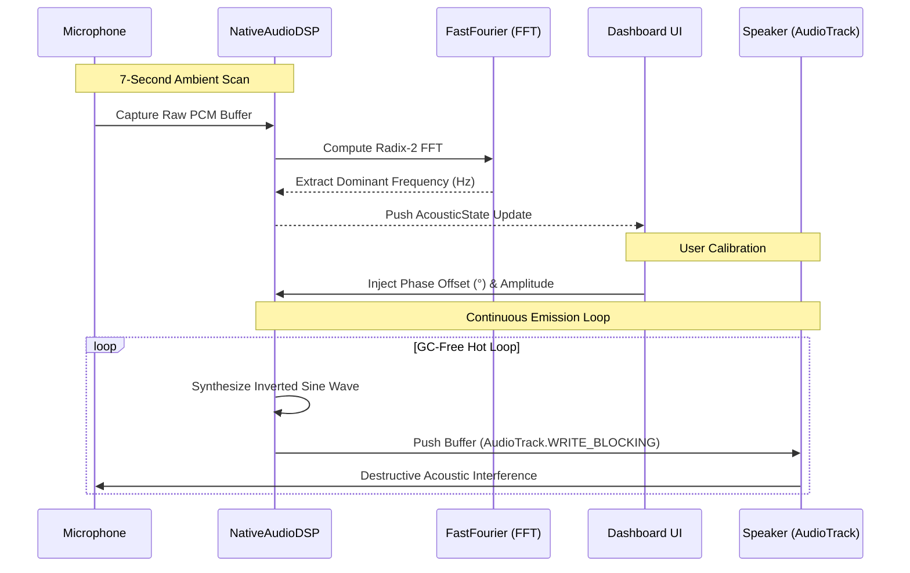

<div align="center">
  

  <h1>AhSilence</h1>
  <p><strong>Silence the ambient hum. Find your perfect quiet.</strong></p>

  <p>
    <a href="https://kotlinlang.org"></a>
    <a href="https://developer.android.com"></a>
    
    
    <a href="LICENSE"></a>
  </p>
</div>

---

## Overview

**AhSilence** is a native Android active noise cancellation (ANC) engine built with Jetpack Compose and Kotlin. It bridges the gap between complex digital signal processing (DSP) and human comfort by analyzing the environment for persistent, low-frequency hums (such as AC units or electrical drones) and emitting phase-inverted audio waves that mathematically neutralize acoustic disturbances.

The application runs a **zero-allocation, GC-free hot loop**, ensuring seamless destructive interference without frame drops or OS throttling.

### Key Features

| Component | Implementation | User Benefit |
|---|---|---|
| **FFT Engine** | Custom Cooley-Tukey Radix-2 algorithm on real-time PCM buffers | Automatically detects the dominant background drone |
| **Phase Calibrator** | Continuous 360° trigonometric dial bound to memory blocks | Manual wave alignment to compensate for hardware/BT latency |
| **OS Shield** | Android Foreground Service with persistent notification | Keeps cancellation active while screen is locked |
| **Stateless UI** | `StateFlow` + Compose hoisted parameters | Zero battery drain from unnecessary recompositions |

---

## Architecture

AhSilence follows **Clean Architecture** with strict unidirectional data flow and complete isolation of the Android framework from core business logic.


### Data Flow



---

## Project Structure

```
app/src/main/java/com/bted/ahsilence/
├── core/                                # Cross-cutting concerns
│   ├── constants/AudioConstants.kt      # Centralised magic numbers
│   ├── di/AudioEngineLocator.kt         # Lightweight service locator
│   └── logging/AppLogger.kt            # Structured logging facade
│
├── domain/                              # Pure Kotlin — zero Android imports
│   ├── model/AcousticState.kt           # Immutable single source of truth
│   └── port/AudioEngine.kt             # DSP engine contract
│
├── data/                                # Android framework implementations
│   ├── engine/FastFourier.kt            # Radix-2 FFT math engine
│   ├── engine/NativeAudioDSP.kt        # AudioRecord / AudioTrack pipeline
│   └── service/ActiveHumService.kt     # Foreground service (OS Shield)
│
├── presentation/                        # State management
│   └── ControlViewModel.kt             # Jetpack Compose bridge
│
├── ui/                                  # Visual layer
│   ├── screen/DashboardScreen.kt        # Main dashboard (Pro / Simple mode)
│   ├── component/                       # Reusable UI elements
│   │   ├── CalibratorRing.kt           # 360° phase dial
│   │   └── GainSlider.kt               # Vertical amplitude fader
│   └── theme/                           # OLED Black / Neon Amber design system
│       ├── Color.kt
│       ├── Theme.kt
│       └── Type.kt
│
└── MainActivity.kt                      # Entry point
```

---

## Getting Started

### Prerequisites

- **Android Studio** Ladybug (2024.2.1+)
- **JDK 21+**
- **Physical Android device** — emulators do not support low-latency hardware microphone FFT testing

### Build

```bash
# Clone
git clone https://github.com/ahmadhassan-bted/ahsilence.git
cd ahsilence

# Build debug APK
./gradlew clean assembleDebug

# Run unit tests
./gradlew test

# Lint check
./gradlew lint
```

### Install

```bash
# Install on connected device
./gradlew installDebug
```

---

## Tech Stack

| Layer | Technology |
|---|---|
| Language | Kotlin 2.0.21 |
| UI | Jetpack Compose (Material 3) |
| State | StateFlow + ViewModel |
| Audio Capture | `AudioRecord` (PCM 16-bit, 44.1kHz) |
| Audio Playback | `AudioTrack` (streaming mode) |
| FFT | Custom Cooley-Tukey Radix-2 |
| Background | Foreground Service (`mediaPlayback`) |
| Build | Gradle (Kotlin DSL) + Version Catalog |
| Min SDK | API 26 (Android 8.0) |

---

## Contributing

See [CONTRIBUTING.md](CONTRIBUTING.md) for branch naming, commit conventions, and the non-negotiable architectural rules (zero-allocation hot loops, domain isolation, UI purity).

## Security

AhSilence is fully offline — zero network calls, zero data collection, zero telemetry. See [SECURITY.md](SECURITY.md).

## Roadmap

See [ROADMAP.md](ROADMAP.md) for planned features including multi-frequency cancellation, adaptive algorithms, and Bluetooth latency compensation.

## License

```
Copyright 2025 Ahmad Hassan

Licensed under the Apache License, Version 2.0.
See LICENSE for details.
```
