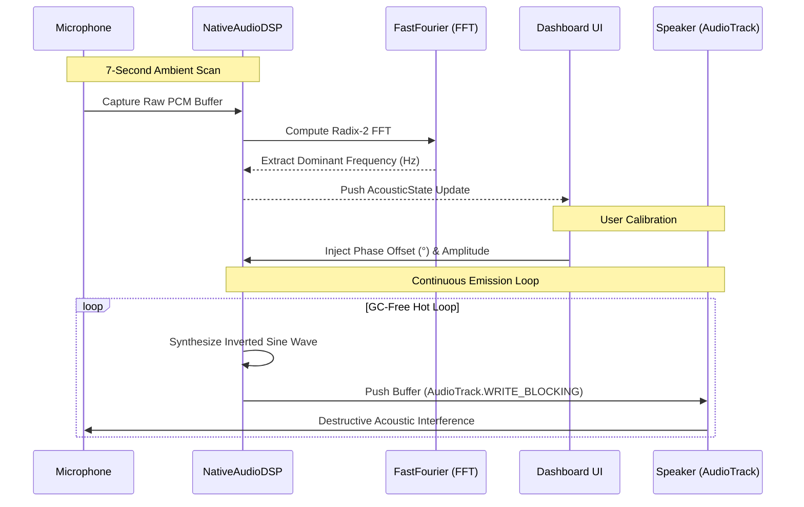

<div align="center">
  

  <h1>AhSilence</h1>
  <p><strong>Silence the ambient hum. Find your perfect quiet.</strong></p>

  <p>
    <a href="https://kotlinlang.org"></a>
    <a href="https://developer.android.com"></a>
    
    
  </p>
</div>

---

## Abstract

**AhSilence** is a native Android active noise cancellation (ANC) engine. It bridges the gap between complex digital signal processing (DSP) and human comfort. By analyzing the environment for persistent, low-frequency hums (such as AC units or electrical drones) and emitting phase-inverted audio waves, the system mathematically neutralizes acoustic disturbances, allowing individuals to reclaim their quiet spaces.

Engineered for performance, the application runs a zero-allocation, garbage-collection-free hot loop, ensuring seamless destructive interference without frame drops or OS throttling.

---

## System Architecture

The repository adheres strictly to **Clean Architecture** principles, enforcing a unidirectional data flow and isolating the Android Framework from the core mathematical business logic.

```mermaid
graph TD
    subgraph Presentation Layer
        UI[Jetpack Compose UI]
        VM[ControlViewModel]
    end

    subgraph Domain Layer
        STATE((AcousticState))
        PORT{AudioEngine Port}
    end

    subgraph Framework Layer
        SERVICE[ActiveHumService]
        DSP[NativeAudioDSP]
        FFT[FastFourier]
    end

    UI -->|Observes State| VM
    UI -->|OS Intent| SERVICE
    VM -->|Updates| STATE
    VM -->|Injects Phase/Gain| PORT
    SERVICE -->|Foreground Shield| DSP
    DSP -->|Implements| PORT
    DSP -->|PCM Buffer Math| FFT

    classDef domain fill:#1E1E1E,stroke:#7F52FF,stroke-width:2px;
    class STATE,PORT domain;

```



---

## Request & Data Flow

The audio processing pipeline prioritizes ultra-low latency. Below is the lifecycle of how the physical environment is sampled, analyzed, and neutralized.



---

## Internal Module Structure

The codebase is highly cohesive and decoupled. Below is the organizational hierarchy of the application.

```text
app/src/main/java/com/bted/ahsilence/
├── domain/                         # Pure Kotlin, Zero Android Dependencies
│   ├── models/AcousticState.kt     # Immutable single source of truth
│   └── ports/AudioEngine.kt        # Abstraction for the DSP layer
│
├── framework/                      # Heavy OS / Hardware Integrations
│   ├── engine/FastFourier.kt       # Radix-2 FFT Math Engine
│   ├── engine/NativeAudioDSP.kt    # AudioRecord / AudioTrack Pipeline
│   └── service/ActiveHumService.kt # Foreground OS Shield
│
├── presentation/                   # State Management
│   └── ControlViewModel.kt         # Jetpack Compose Bridge
│
└── ui/                             # Visual Representation
    ├── screens/DashboardScreen.kt  # Stateless UI (Pro / Simple mode)
    ├── screens/components/         # Reusable UI dials and sliders
    └── theme/                      # Pure OLED Black / Neon Amber Styling

```

---

## Feature Overview

| Component               | Technical Implementation                                                                               | Human Benefit                                                                        |
| ----------------------- | ------------------------------------------------------------------------------------------------------ | ------------------------------------------------------------------------------------ |
| **Acoustic FFT Engine** | Runs a custom Cooley-Tukey Radix-2 algorithm to parse real-time PCM buffers into discrete frequencies. | Automatically listens to the room and locks onto the most annoying background drone. |
| **Phase Calibrator**    | Employs a continuous 360° trigonometric UI dial bound natively to memory blocks.                       | Allows manual wave alignment to compensate for unpredictable Bluetooth latency.      |
| **OS Shield**           | Binds the background thread to an Android Foreground Service.                                          | Keeps the cancellation wave active while the screen is locked or in pocket.          |
| **Stateless UI**        | Engineered purely with `StateFlow` and Compose hoisted parameters.                                     | Prevents battery drain and visual stutter while rendering complex data.              |

---

## Build & Deployment Pipeline

The project uses Gradle (Kotlin DSL) and targets Android API 36.

**Prerequisites:**

- Android Studio (Ladybug / 2024.2.1+)
- JDK 21+
- A physical Android device (Emulators do not accurately support low-latency hardware microphone FFT testing).

**Compilation:**

```bash
# Clone the repository
git clone [https://github.com/ahmadhassan-bted/ahsilence.git](https://github.com/ahmadhassan-bted/ahsilence.git)

# Navigate to project directory
cd ahsilence

# Clean and Build
./gradlew clean build

```

---

## Development Workflow & Contributions

The repository aims to maintain a high standard of architectural cleanliness. New features, pull requests, and DSP optimizations are welcomed.

When contributing, please ensure:

1. **Zero Allocations in Hot Loops:** Any modifications to `NativeAudioDSP.kt` or `FastFourier.kt` must not utilize the `new` keyword, create objects, or trigger the JVM Garbage Collector.
2. **Domain Isolation:** Android lifecycle elements (`Context`, `Intents`) must never leak into the `/domain` or `/presentation` layers.
3. **UI Purity:** All Jetpack Compose screens must remain stateless.
